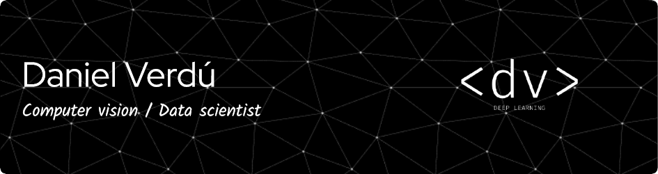

# Hi, I'm Daniel Verdú 👋 

💡 Industrial engineer passionate about AI, technology, basketball, traveling & particle physics. 

💼 Since 2023, I work as a Senior Data Scientist @ Freepik Company, focused in Generative AI topics

## Skills
- 🧠 Python, Pytorch & HuggingFace ecosystem (Diffusers & Transformers mainly) are my daily basics.
- ⚙️ Besides, I am familiar with both hardware & software (OpenCV, PIL) related to the computer vision industry
- 🏆 I won the SpainAI Hackathon (Computer vision challenge) that consisted of upscaling low-resolution images. Besides, in June 2014, I was awarded for my bachelor's thesis as "Best National Project in control systems" by the Spanish Automation Committee (CEA) for developing a drone control flight algorithm.

## Find me around the web 🌎:

I love connecting with different people so if you want to say hi, I'll be happy to meet you more! :)

Made with :heart:

<!--
**davertor/davertor** is a ✨ _special_ ✨ repository because its `README.md` (this file) appears on your GitHub profile.

Here are some ideas to get you started:

- 🔭 I’m currently working on ...
- 🌱 I’m currently learning ...
- 👯 I’m looking to collaborate on ...
- 🤔 I’m looking for help with ...
- 💬 Ask me about ...
- 📫 How to reach me: ...
- 😄 Pronouns: ...
- ⚡ Fun fact: ...
-->
